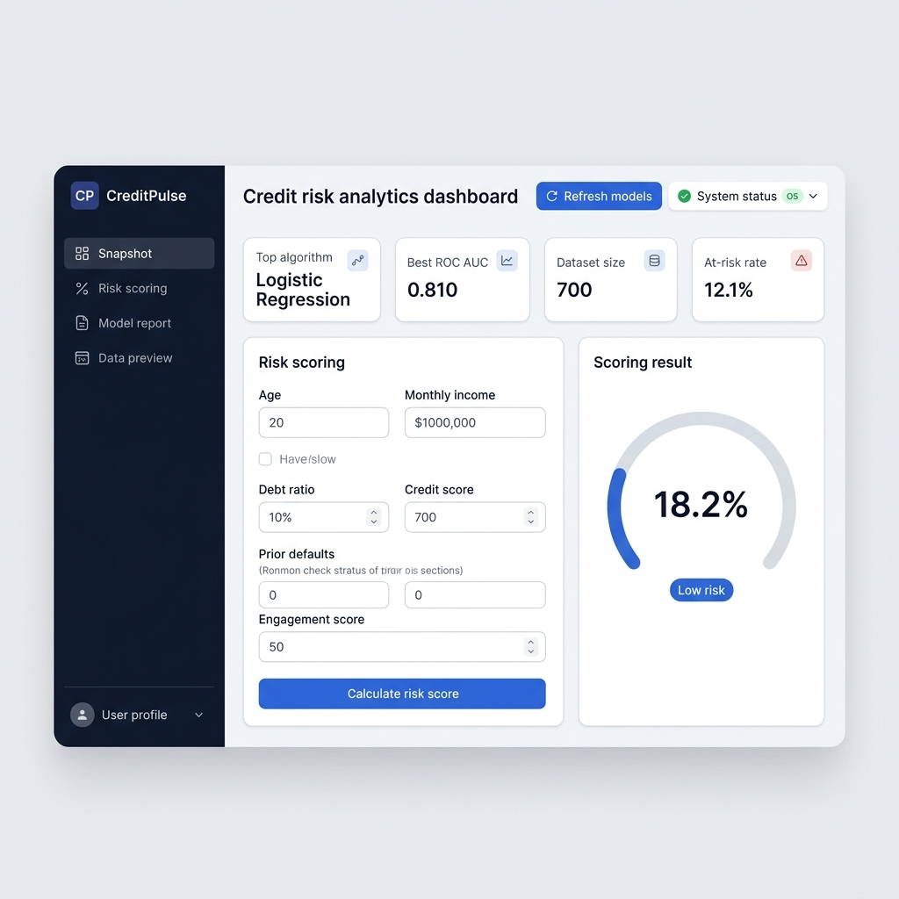

# Predictive Modeling Using Machine Learning

## CreditPulse — Credit Risk Analytics Dashboard

**CreditPulse** is a supervised machine learning project that predicts customer default risk using tabular financial attributes. It includes custom implementations of three classification algorithms and an interactive web-based dashboard for real-time credit risk scoring.

> **Note:** All machine learning algorithms in this project — Logistic Regression, Decision Tree, and Random Forest — are implemented from scratch using NumPy, without relying on external ML frameworks such as scikit-learn.

---

## Table of Contents

- [Introduction](#introduction)
- [Live Demo](#live-demo)
- [Features](#features)
- [Tech Stack](#tech-stack)
- [Project Structure](#project-structure)
- [Dataset](#dataset)
- [Models and Results](#models-and-results)
- [Visualizations](#visualizations)
- [Getting Started](#getting-started)
- [API Reference](#api-reference)
- [Author](#author)

---

## Introduction

Credit risk assessment is a fundamental challenge in the financial services industry. Accurately predicting whether a customer is likely to default on a loan enables institutions to make informed lending decisions, minimize losses, and maintain portfolio health.

This project presents an end-to-end predictive modeling pipeline that addresses the credit default prediction problem. The workflow includes:

1. **Data Generation** — A synthetic dataset of 700 customer records is generated with six financially meaningful features and a binary outcome label.
2. **Model Training** — Three supervised classification models are trained and compared: Logistic Regression (gradient descent), Decision Tree (Gini impurity), and Random Forest (bootstrap aggregation).
3. **Evaluation** — Models are evaluated on a held-out test set using standard classification metrics: Accuracy, Precision, Recall, F1-Score, and ROC-AUC.
4. **Deployment** — A lightweight Python HTTP server exposes REST API endpoints for model inference, and an interactive web dashboard enables real-time risk scoring.
5. **Visualization** — SVG charts (ROC curves, confusion matrix, feature importance) are generated programmatically for model explainability.

---

## Live Demo



*Figure: CreditPulse dashboard displaying model performance metrics, applicant risk scoring form, and algorithm comparison panel.*

---

## Features

- Custom implementation of Logistic Regression, Decision Tree, and Random Forest classifiers
- Interactive web dashboard with real-time credit risk predictions
- REST API for model inference and retraining
- Side-by-side comparison of three classification algorithms
- Feature importance analysis for model interpretability
- Programmatically generated SVG visualizations
- Responsive UI design for desktop and mobile browsers
- One-click launcher for Windows

---

## Tech Stack

| Component | Technology |
|-----------|------------|
| Machine Learning | Python, NumPy, Pandas |
| Web Server | Python `http.server` (ThreadingHTTPServer) |
| Frontend | HTML5, CSS3, JavaScript |
| Visualizations | Custom SVG generation |
| API Format | RESTful JSON |

---

## Project Structure

```
Predictive-Modeling-Using-Machine-Learning/
├── train_predictive_model.py       # ML pipeline: custom models, training, evaluation, chart generation
├── server.py                       # HTTP API server with train, predict, and retrain endpoints
├── index.html                      # Dashboard user interface
├── styles.css                      # Dashboard styling (responsive layout)
├── app.js                          # Frontend logic (API integration, rendering)
├── customer_default_dataset.csv    # Generated dataset (700 records, 7 columns)
├── model_metrics_summary.csv       # Model evaluation metrics
├── roc_curve.svg                   # ROC curve comparison chart
├── confusion_matrix.svg            # Best model confusion matrix
├── feature_importance.svg          # Random Forest feature importance chart
├── START_DASHBOARD.bat             # Windows one-click launcher
├── images/
│   └── live-demo.png               # Dashboard screenshot
└── .gitignore
```

---

## Dataset

A synthetic dataset is generated to simulate real-world credit customer profiles. The data generation process uses statistically meaningful distributions to produce realistic feature values and outcome labels.

| Feature | Description | Distribution |
|---------|-------------|--------------|
| `age` | Customer age in years | Normal (μ=44, σ=12), clipped to 18–75 |
| `monthly_income` | Monthly income | Log-normal (μ=8.25, σ=0.42) |
| `debt_ratio` | Debt-to-income ratio | Beta (α=2.2, β=5.0) |
| `credit_score` | Credit score | Normal (μ=680, σ=65), clipped to 420–840 |
| `prior_defaults` | Number of previous defaults | Poisson (λ=0.35), clipped to 0–4 |
| `engagement_score` | Customer engagement metric | Beta (α=3.0, β=2.2) × 100 |
| `outcome_default_risk` | **Target variable** (1 = default risk, 0 = safe) | Bernoulli, derived from logistic risk model |

- **Total samples:** 700
- **Train/Test split:** 75% / 25%
- **Positive class rate:** ~12%

---

## Models and Results

### Algorithm Overview

| Model | Technique | Description |
|-------|-----------|-------------|
| Logistic Regression | Gradient Descent | Sigmoid activation with binary cross-entropy loss and L2 regularization |
| Decision Tree | Recursive Partitioning | Gini impurity-based splitting with configurable depth and minimum sample constraints |
| Random Forest | Bootstrap Aggregation | Ensemble of 60 decision trees with random feature subsampling |

### Performance Comparison

| Model | Accuracy | Precision | Recall | F1 Score | ROC AUC |
|-------|----------|-----------|--------|----------|---------|
| **Logistic Regression** | 0.897 | 0.444 | 0.235 | 0.308 | **0.810** |
| Random Forest | 0.903 | 0.500 | 0.176 | 0.261 | 0.790 |
| Decision Tree | 0.880 | 0.300 | 0.176 | 0.222 | 0.720 |

**Best model by ROC-AUC:** Logistic Regression (0.810)

Logistic Regression achieves the highest area under the ROC curve, indicating superior discrimination ability across all classification thresholds.

---

## Visualizations

The training pipeline generates three SVG charts for model analysis:

| File | Description |
|------|-------------|
| `roc_curve.svg` | Receiver Operating Characteristic curves comparing all three models |
| `confusion_matrix.svg` | Classification counts (TP, TN, FP, FN) for the best-performing model |
| `feature_importance.svg` | Feature importance scores from the Random Forest classifier |

---

## Getting Started

### Prerequisites

- Python 3.10 or later
- NumPy
- Pandas

### Installation

```bash
# Clone the repository
git clone https://github.com/tanishkakes02-cpu/Predictive-Modeling-Using-Machine-Learning.git
cd Predictive-Modeling-Using-Machine-Learning

# Install dependencies
pip install numpy pandas
```

### Running the Dashboard

**Option 1 — Windows Launcher**

Double-click `START_DASHBOARD.bat`. The server and browser will open automatically.

**Option 2 — Command Line**

```bash
python server.py
```

Open `http://localhost:8000` in your browser.

### Rebuilding Model Artifacts

To regenerate the dataset, retrain all models, and recreate visualizations:

```bash
python train_predictive_model.py
```

---

## API Reference

| Method | Endpoint | Description |
|--------|----------|-------------|
| `GET` | `/api/metrics` | Returns current model performance metrics and feature importance data |
| `POST` | `/api/predict` | Accepts customer attributes as JSON and returns a risk score with classification |
| `POST` | `/api/retrain` | Retrains all models on freshly generated data and returns updated metrics |
| `GET` | `/health` | Returns server health status |

### Example: Predict Request

```json
POST /api/predict
Content-Type: application/json

{
  "age": 42,
  "monthly_income": 4200,
  "debt_ratio": 0.34,
  "credit_score": 680,
  "prior_defaults": 0,
  "engagement_score": 62
}
```

### Example: Response

```json
{
  "probability": 0.1823,
  "risk_level": "Low",
  "decision": "Likely safe to approve",
  "best_model": "Logistic Regression",
  "model_probabilities": {
    "Logistic Regression": 0.1823,
    "Decision Tree": 0.1245,
    "Random Forest": 0.1567
  },
  "drivers": ["No major negative signals"]
}
```

---

## Author

**Tanishka Kesarwani**

---

## License

This project is available for academic and educational purposes.
